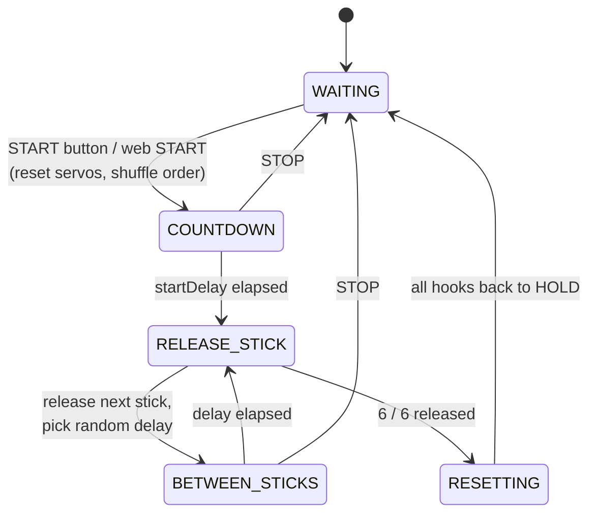

<div align="center">

# 🎯 Stick Catcher

**A six-stick reaction game powered by an ESP8266, a PCA9685 servo driver and a phone-friendly web panel.**


</div>

Six sticks hang from six servo-driven hooks. Press **START**, wait through the countdown, and the hooks let go of the sticks **one at a time, in a random order, at random intervals**. Every stick drops exactly once per round. Your job: catch them before they hit the floor.

The ESP8266 also creates its own Wi-Fi network, so you can start the game, stop it, tune the timing and calibrate every servo from your phone. No router or internet needed.

---

## Table of contents

- [How to play](#-how-to-play)
- [Features](#-features)
- [Hardware](#-hardware)
- [Wiring](#-wiring)
- [Get the code onto the board](#-get-the-code-onto-the-board)
  - [Option A: VS Code + PlatformIO (recommended)](#option-a--vs-code--platformio-recommended)
  - [Option B: Arduino IDE](#option-b--arduino-ide)
  - [Option C: PlatformIO CLI](#option-c--platformio-cli)
- [Web control panel](#-web-control-panel)
- [Settings and calibration](#-settings-and-calibration)
- [Servo test sketch](#-servo-test-sketch)
- [How it works](#-how-it-works)
- [HTTP API](#-http-api)
- [Project structure](#-project-structure)
- [Troubleshooting](#-troubleshooting)
- [License](#-license)

---

## 🎮 How to play

1. **Load the sticks.** Reset the game (or power it on). All six hooks move to the *hold* position. Hang one stick from each hook.
2. **Get ready.** Stand (or sit) below the sticks with your hands ready. One or more players can take part.
3. **Start.** Press the physical **START** button, or tap **▶ START GAME** in the web panel.
4. **Countdown.** Nothing happens for **5 seconds** by default. Use the time to get into position.
5. **Catch!** A random hook releases its stick. After a random pause of **0.5 to 2 s** the next one drops, and so on until all six have fallen. You never know which stick is next or when.
6. **Round over.** Half a second after the last stick, every hook resets to *hold* and the game goes back to waiting. Reload the sticks and press START again.

**Scoring ideas** (the firmware does not keep score, so pick your own rules):

| Mode | Rule |
| --- | --- |
| Solo | Count how many of the 6 sticks you catch. Beat your personal best. |
| Head-to-head | Two players, one hand each side. Whoever catches more wins the round. |
| Hard mode | Shrink the delays in the web panel (for example 100 to 600 ms) for a faster round. |
| Marathon | Play 5 rounds and add up the catches. |

Press **■ STOP / RESET** at any time to abort a round and return every hook to *hold*.

---

## ✨ Features

- 🎲 **Fair random order.** A Fisher-Yates shuffle guarantees each of the 6 sticks drops exactly once per round.
- ⏱ **Random timing.** Configurable start countdown and a min/max random gap between drops.
- 📶 **Built-in Wi-Fi access point.** No router needed. Connect to `STICK-CATCHER` and open a page.
- 📱 **Mobile web panel.** Start/stop, timing sliders, servo angle sliders and per-servo test buttons.
- 🔘 **Physical START button.** Debounced, works alongside the web panel.
- 🧪 **Servo test mode.** Fire any single hook from the web panel to check your mechanics.
- 🔧 **Standalone servo test sketch.** Check wiring and find your servo limits from the serial monitor before running the game.
- 🖥 **Serial log.** Everything the game does is printed at 115200 baud.
- 🧩 **Non-blocking state machine.** Web requests keep being served while a round is running.

---

## 🧰 Hardware

| Qty | Part | Notes |
| --- | --- | --- |
| 1 | ESP8266 dev board | NodeMCU v2 (ESP-12E) is the default. A Wemos D1 mini also works. |
| 1 | PCA9685 16-channel PWM/servo driver | I²C address `0x40` (default). |
| 6 | SG90 micro servos | One per stick. Any 50 Hz hobby servo works. |
| 1 | Momentary push button | Wired to GND, uses the internal pull-up. |
| 1 | **5 V power supply, 2 A or more** | Powers the servos only. See the warning below. |
| n | Jumper wires, breadboard, hooks and sticks | Build the release mechanism to suit your sticks. |

> ⚠️ **Do not power the servos from the ESP8266's 3.3 V pin or its USB port.** Six SG90s can pull well over 1 A when they move together. Feed them from a separate 5 V supply into the PCA9685's **V+** terminal, and **join the grounds** of the supply, the PCA9685 and the ESP8266.

---

## 🔌 Wiring

### Connections

| From | To | Purpose |
| --- | --- | --- |
| ESP8266 `D2` (GPIO4) | PCA9685 `SDA` | I²C data |
| ESP8266 `D1` (GPIO5) | PCA9685 `SCL` | I²C clock |
| ESP8266 `3V3` | PCA9685 `VCC` | Logic power |
| ESP8266 `GND` | PCA9685 `GND` | Common ground |
| External 5 V `+` | PCA9685 `V+` (terminal block) | Servo power |
| External 5 V `−` | PCA9685 `GND` | Common ground |
| ESP8266 `D5` (GPIO14) | Button pin 1 | START button |
| ESP8266 `GND` | Button pin 2 | START button |
| Servo 1 to 6 | PCA9685 channels `0` to `5` | Stick hooks |

### Diagram

```
                       ┌───────────────────┐
   USB power ─────────▶│  ESP8266 NodeMCU  │
                       │                   │
                       │  D1 (GPIO5) ──────┼────────▶ SCL ┐
                       │  D2 (GPIO4) ──────┼────────▶ SDA │
                       │  3V3 ─────────────┼────────▶ VCC │   ┌───────────────┐
                       │  GND ─────────────┼──┬─────▶ GND ├──▶│    PCA9685    │
                       │                   │  │           ┘   │               │
                       │  D5 (GPIO14) ──┐  │  │               │  CH0 ─ Servo 1│
                       └────────────────┼──┘  │               │  CH1 ─ Servo 2│
                                        │     │               │  CH2 ─ Servo 3│
                                  [START button]              │  CH3 ─ Servo 4│
                                        │     │               │  CH4 ─ Servo 5│
                                        └─────┤               │  CH5 ─ Servo 6│
                                              │               │               │
   External 5 V, 2 A+ ──── (+) ───────────────┼──────────────▶│  V+           │
                       └─── (−) ──────────────┴──────────────▶│  GND          │
                                                              └───────────────┘
```

Servo wire colours: **brown/black** = GND, **red** = V+, **orange/yellow** = signal. Plug them into the 3-pin headers with the signal wire on the `PWM` row.

**Pin summary** (all defined at the top of [`stick_catching_game.ino`](stick_catching_game/stick_catching_game.ino)):

| Function | NodeMCU pin | GPIO |
| --- | --- | --- |
| I²C SDA | D2 | 4 |
| I²C SCL | D1 | 5 |
| START button | D5 | 14 |

---

## 🚀 Get the code onto the board

Clone the repository first:

```bash
git clone https://github.com/Am4l-babu/stick-catching-game.git
cd stick-catching-game
```

Plug the ESP8266 into your computer with a **data-capable** micro-USB cable. You may need the [CP210x](https://www.silabs.com/developers/usb-to-uart-bridge-vcp-drivers) or [CH340](https://www.wch-ic.com/downloads/CH341SER_EXE.html) driver, depending on your board.

### Option A · VS Code + PlatformIO (recommended)

PlatformIO downloads the ESP8266 toolchain and the servo library for you, so there is nothing to install by hand.

1. Install [Visual Studio Code](https://code.visualstudio.com/).
2. Open the **Extensions** view (`Ctrl+Shift+X`), search for **PlatformIO IDE** and install it. Restart VS Code if it asks. The first launch takes a minute while PlatformIO sets itself up.
3. Choose **File ▸ Open Folder…** and open the **repository root** (the folder that contains `platformio.ini`).
4. Wait for PlatformIO to finish indexing. The first build also downloads the platform and libraries.
5. Use the buttons in the blue status bar at the bottom:

   | Button | Action |
   | --- | --- |
   | ✔ **Build** | Compile the code |
   | → **Upload** | Compile and flash the board |
   | 🔌 **Serial Monitor** | Open the serial log at 115200 baud |

   Or press `Ctrl+Alt+U` to upload and `Ctrl+Alt+S` to open the serial monitor.
6. If PlatformIO picks the wrong port, set it in [`platformio.ini`](platformio.ini):
   ```ini
   upload_port  = COM3        ; Windows, e.g. COM3
   monitor_port = COM3        ; Linux: /dev/ttyUSB0   macOS: /dev/cu.usbserial-*
   ```

**Using a Wemos D1 mini?** Switch environments in the status bar (the `Default (nodemcuv2)` picker) to `d1_mini`, or run `pio run -e d1_mini -t upload`.

### Option B · Arduino IDE

1. Install the [Arduino IDE](https://www.arduino.cc/en/software) (2.x recommended).
2. **Add the ESP8266 board package**
   - Open **File ▸ Preferences** and paste this into *Additional boards manager URLs*:
     ```
     http://arduino.esp8266.com/stable/package_esp8266com_index.json
     ```
   - Open **Tools ▸ Board ▸ Boards Manager**, search for **esp8266** and install *esp8266 by ESP8266 Community*.
3. **Install the servo library**
   - Open **Tools ▸ Manage Libraries…**, search for **Adafruit PWM Servo Driver Library** and install it. Accept the dependency prompt if it asks to install **Adafruit BusIO**.
4. **Open the sketch.** Choose **File ▸ Open…** and pick [`stick_catching_game/stick_catching_game.ino`](stick_catching_game/stick_catching_game.ino). Both `stick_catching_game.ino` and `web_page.h` open as tabs.
5. **Select the board and port**
   - **Tools ▸ Board ▸ esp8266 ▸ NodeMCU 1.0 (ESP-12E Module)** (or *LOLIN(WEMOS) D1 R2 & mini*).
   - **Tools ▸ Upload Speed ▸ 921600** (use 115200 if uploads fail).
   - **Tools ▸ Port ▸** the COM port of your board.
6. Click **Upload** (→). When it finishes, open **Tools ▸ Serial Monitor** and set **115200 baud** to watch the log.

### Option C · PlatformIO CLI

If you prefer the terminal (works without VS Code):

```bash
pip install platformio             # once

pio run                            # build
pio run -t upload                  # build + flash
pio device monitor                 # serial monitor, 115200 baud
pio run -e d1_mini -t upload       # flash a Wemos D1 mini instead
```

---

## 📱 Web control panel

1. Power the board. The status of the access point is printed on the serial monitor.
2. On your phone or laptop, join the Wi-Fi network:

   | | |
   | --- | --- |
   | **SSID** | `STICK-CATCHER` |
   | **Password** | `12345678` |

3. Open **<http://192.168.4.1>** in a browser. Your phone may warn that the network has no internet. Stay connected.

The panel has four cards:

| Card | What it does |
| --- | --- |
| **Status + Start/Stop** | Shows the live game state (`WAITING`, `STARTING IN 3s`, `RELEASING`, `WAITING - 2/6`, `RESETTING`). START begins a round; STOP/RESET aborts it and re-arms every hook. |
| **⏱ Timing** | Sliders for start delay, minimum and maximum random gap, and servo release time. |
| **⚙ Servo Angles** | Sliders for the HOLD and RELEASE angles. |
| **🧪 Test Individual Servos** | Fires one hook (release, then return to hold). Only works while the game is idle. |

> 💡 Change the Wi-Fi name and password by editing `AP_SSID` and `AP_PASSWORD` near the top of the `.ino`. The password must be at least 8 characters.

---

## 🎛 Settings and calibration

Everything below is a variable at the top of [`stick_catching_game.ino`](stick_catching_game/stick_catching_game.ino), and most of it can also be changed live from the web panel.

| Setting | Default | Web panel range | Meaning |
| --- | --- | --- | --- |
| `holdAngle` | `0°` | 0 to 180° | Servo angle that *holds* a stick |
| `releaseAngle` | `90°` | 0 to 180° | Servo angle that *drops* a stick |
| `releaseTime` | `200 ms` | 50 to 1000 ms | How long the hook is given to move |
| `startDelay` | `5000 ms` | 1 to 15 s | Pause between START and the first drop |
| `minDelay` | `500 ms` | 100 ms to 5 s | Shortest random gap between drops |
| `maxDelay` | `2000 ms` | 200 ms to 10 s | Longest random gap between drops |
| `SERVO_MIN` | `150` | n/a (code only) | PCA9685 pulse count at 0° |
| `SERVO_MAX` | `600` | n/a (code only) | PCA9685 pulse count at 180° |

> ⚠️ Values saved from the web panel live in RAM only, so **they reset to the defaults above when the board restarts.** To make a setting permanent, change the default in the `.ino` and re-upload.

### Calibrating your servos

SG90 clones vary, so the defaults may not give a true 0° to 180° sweep.

1. Mount each hook and load a stick. Open the web panel.
2. In **Servo Angles**, set HOLD and RELEASE so the hook clearly holds the stick, then clearly lets go. Press **SAVE SERVO SETTINGS**.
3. Press **STICK 1 … STICK 6** to test each hook. Adjust the angles or the hook mechanics until every stick releases reliably.
4. If a servo buzzes or hits its end stop, reduce `SERVO_MAX` or raise `SERVO_MIN` (for example 130 to 550) and re-upload.
5. Tune **Servo release time** so the hook has time to move but the round still feels snappy.

Not sure whether a problem is the wiring, the power or the game code? Flash the [servo test sketch](#-servo-test-sketch) first.

---

## 🔧 Servo test sketch

[`servo_test/servo_test.ino`](servo_test/servo_test.ino) is a small standalone sketch for **checking your wiring and calibrating the servos before you run the game**. It uses the same pins and the same PCA9685 settings as the game, and you control it by typing single-letter commands in the serial monitor.

On boot it scans the I²C bus (you should see the PCA9685 at `0x40`), moves all six hooks to HOLD and prints the command list.

| Command | Action |
| --- | --- |
| `1` to `6` | Select that servo and fire it (release, wait, return to hold) |
| `a` | Fire all six servos in order |
| `w` | Slow 0° → 180° → 0° sweep of the selected servo |
| `+` / `-` | Nudge the selected servo by ±5° and print its angle and pulse count |
| `h` | Move all servos to HOLD |
| `r` | Move all servos to RELEASE |
| `i` | Scan the I²C bus |
| `?` | Show the help |

**Typical use**

1. Flash the sketch (see below) and open the serial monitor at **115200 baud**.
2. Type `i`. If nothing is found, fix SDA/SCL/power before anything else.
3. Type `1` to `6` to make sure every hook moves. A dead servo points to a wiring or power problem on that channel.
4. Use `w` to see each servo's real travel, and `+`/`-` to find the exact HOLD and RELEASE angles for your mechanism. Copy them into `holdAngle` / `releaseAngle` in the game (or into the web panel).
5. If a servo buzzes or stalls near the ends of its travel, adjust `SERVO_MIN` / `SERVO_MAX` in both sketches.

**How to flash it**

| Toolchain | Steps |
| --- | --- |
| **VS Code + PlatformIO** | Click the PlatformIO icon ▸ **Project Tasks** ▸ **servo_test** ▸ **Upload**, then **Monitor**. Or run `pio run -e servo_test -t upload` and `pio device monitor`. |
| **Arduino IDE** | **File ▸ Open…** ▸ `servo_test/servo_test.ino`, select the same board and port as for the game, then **Upload**. Open the Serial Monitor at 115200 baud. |

When you are done, flash the game again (`nodemcuv2` environment in PlatformIO, or the `stick_catching_game` sketch in the Arduino IDE). The test sketch replaces the game on the board; it does not run alongside it.

---

## ⚙️ How it works

The game is a small non-blocking state machine that runs inside `loop()`:



- **Random order.** At START the array `[0,1,2,3,4,5]` is shuffled with Fisher-Yates and released in that order, so each stick drops exactly once.
- **Servo control.** The ESP8266 talks to the PCA9685 over I²C (`Wire.begin(4, 5)`) at 50 Hz. Angles are mapped to pulse counts between `SERVO_MIN` and `SERVO_MAX`.
- **Hooks stay open.** A released servo remains at the release angle until the round ends, then all six return to HOLD together.
- **Networking.** The board runs as a Wi-Fi access point (`WIFI_AP`) with an `ESP8266WebServer` on port 80.
- **Random seed.** `randomSeed(micros())` at boot, so each power-up gives a different sequence.

---

## 🌐 HTTP API

The web panel is a thin wrapper around a few `GET` endpoints, so you can script the game too:

| Endpoint | Parameters | Description |
| --- | --- | --- |
| `/` | none | The control panel (HTML) |
| `/start` | none | Start a round (ignored if one is running) |
| `/stop` | none | Abort and reset all servos |
| `/status` | none | Plain-text state, e.g. `WAITING - 3/6` |
| `/settings` | `start`, `min`, `max`, `release` (ms) | Update timing |
| `/servo` | `hold`, `release` (degrees) | Update servo angles |
| `/test` | `servo` (0 to 5) | Test one hook (idle only) |

```bash
curl http://192.168.4.1/start
curl "http://192.168.4.1/settings?start=3000&min=300&max=1200&release=200"
curl http://192.168.4.1/status
```

---

## 📁 Project structure

```
stick-catching-game/
├── stick_catching_game/            ← the sketch (Arduino IDE opens this folder)
│   ├── stick_catching_game.ino     ← game logic, servo control, web handlers
│   └── web_page.h                  ← the HTML/CSS/JS control panel
├── servo_test/                     ← standalone wiring/calibration sketch
│   └── servo_test.ino
├── pio/
│   └── servo_test_entry.cpp        ← lets PlatformIO build servo_test
├── platformio.ini                  ← PlatformIO build config (VS Code / CLI)
├── .vscode/
│   └── extensions.json             ← recommends the PlatformIO extension
├── .gitignore
├── LICENSE
└── README.md
```

The same sketch folders are used by both toolchains, so there is a single copy of the code. `platformio.ini` points PlatformIO's `src_dir` at `stick_catching_game/` for the game, and the `servo_test` environment builds `servo_test/servo_test.ino` through the small wrapper in `pio/`.

| PlatformIO environment | What it builds |
| --- | --- |
| `nodemcuv2` (default) | The game, for NodeMCU |
| `d1_mini` | The game, for Wemos D1 mini |
| `servo_test` | The servo test sketch (NodeMCU) |

---

## 🩺 Troubleshooting

| Symptom | Likely cause and fix |
| --- | --- |
| **Upload fails / "port not found"** | Try another USB cable (many are charge-only). Install the CP210x/CH340 driver. Hold **FLASH** while uploading starts if your board needs it. Lower the upload speed to 115200. |
| **`STICK-CATCHER` network doesn't appear** | Wait a few seconds after boot. Check the serial monitor for the IP address. Make sure the code uploaded. |
| **Page won't load** | Stay connected even if the phone says "no internet". Turn off mobile data and VPN. Use `http://` (not `https://`) and `192.168.4.1`. |
| **Servos don't move** | Flash the [servo test sketch](#-servo-test-sketch) and type `i` to check the PCA9685 is found. Check the external 5 V supply and that **all grounds are joined**. Verify SDA to D2 and SCL to D1. Confirm the PCA9685 address is `0x40`. |
| **Servos jitter, or the ESP8266 keeps resetting** | The power supply is too weak or the servos are drawing from the ESP. Use a dedicated 5 V supply of at least 2 A and add a 470 to 1000 µF capacitor across V+/GND on the PCA9685. |
| **Sticks don't release, or drop early** | Recalibrate: adjust HOLD/RELEASE angles and the hook geometry. See [Calibrating your servos](#calibrating-your-servos). |
| **Settings disappear after reboot** | By design. Web-panel values live in RAM. Change the defaults in the `.ino`. |
| **Serial monitor shows garbage** | Set the baud rate to **115200**. |
| **Compile error: `Adafruit_PWMServoDriver.h` not found** | Arduino IDE: install *Adafruit PWM Servo Driver Library*. PlatformIO installs it automatically. |

---

## 📄 License

Released under the [MIT License](LICENSE). Have fun, and don't drop the sticks. 🎯
