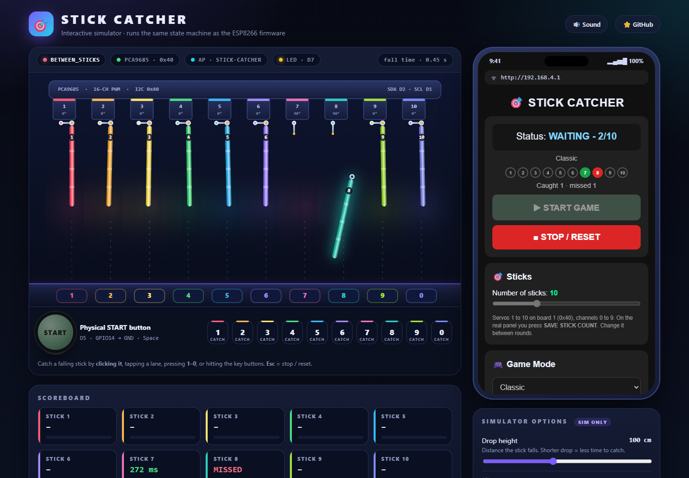
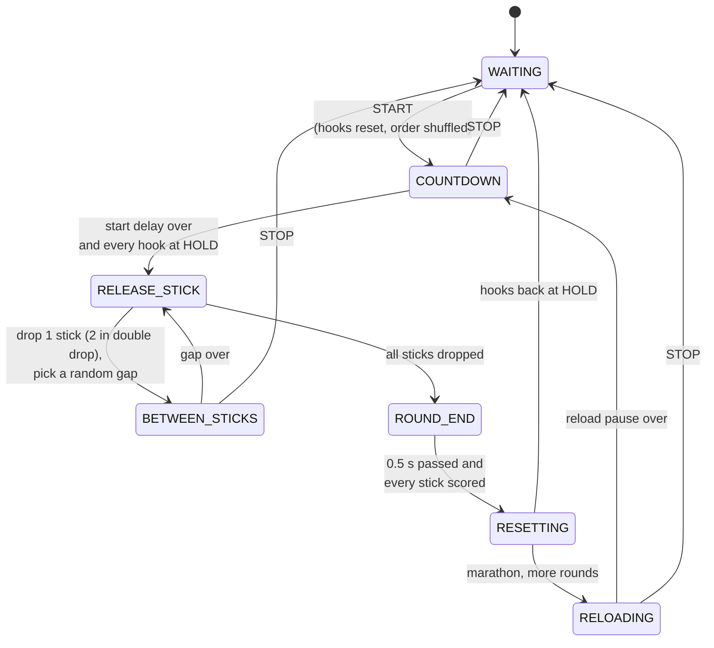

<div align="center">

# 🎯 Stick Catcher

**A reaction game with 1 to 32 falling sticks, powered by an ESP8266, PCA9685 servo drivers and a phone-friendly web panel.**

[](https://github.com/Am4l-babu/stick-catching-game/actions/workflows/build.yml)


</div>

Sticks hang from servo-driven hooks: **6 by default, up to 16 with one PCA9685 board and up to 32 with two**. Press **START**, wait through the countdown, and the hooks let go of the sticks **one at a time, in a random order, at random intervals**. Every stick drops exactly once per round. Your job: catch them before they hit the floor.

The ESP8266 creates its own Wi-Fi network, so you can start the game, pick a game mode, choose how many sticks you play with, tune the timing and calibrate every hook from your phone. Everything you set is saved on the board. No router or internet needed.

> **Versions.** This is **v3**: game modes, settings saved to flash, per-hook trim, buzzer and LED, optional floor sensors for scoring, up to 32 sticks, wireless updates. The working six-stick version is tagged [**`v1.0.0`**](https://github.com/Am4l-babu/stick-catching-game/tree/v1.0.0). See the [changelog](CHANGELOG.md).

<p align="center">
  <a href="https://am4l-babu.github.io/stick-catching-game/simulator.html">
    
  </a>
</p>

<p align="center">
  <a href="https://am4l-babu.github.io/stick-catching-game/simulator.html"><b>▶ Play the simulator in your browser</b></a> · no hardware needed
</p>

---

## Table of contents

- [Try it in your browser](#-try-it-in-your-browser)
- [How to play](#-how-to-play)
- [Game modes](#-game-modes)
- [Features](#-features)
- [Hardware](#-hardware)
- [Wiring](#-wiring)
- [Get the code onto the board](#-get-the-code-onto-the-board)
  - [Option A: VS Code + PlatformIO (recommended)](#option-a--vs-code--platformio-recommended)
  - [Option B: Arduino IDE](#option-b--arduino-ide)
  - [Option C: PlatformIO CLI](#option-c--platformio-cli)
- [Wireless updates](#-wireless-updates)
- [Web control panel](#-web-control-panel)
- [Choosing the number of sticks](#-choosing-the-number-of-sticks)
- [Scoring with floor sensors](#-scoring-with-floor-sensors)
- [Settings and calibration](#-settings-and-calibration)
- [Servo test sketch](#-servo-test-sketch)
- [How it works](#-how-it-works)
- [HTTP API](#-http-api)
- [Tests and CI](#-tests-and-ci)
- [Project structure](#-project-structure)
- [Troubleshooting](#-troubleshooting)
- [License](#-license)

---

## 🕹 Try it in your browser

Want to see the game before you build it? Open the **[interactive simulator](https://am4l-babu.github.io/stick-catching-game/simulator.html)**. It is a single self-contained page ([`docs/simulator.html`](docs/simulator.html)) that runs the same state machine as the firmware, so what you see matches what the hardware does.

| | |
| --- | --- |
| 🎯 **Play it** | Click a falling stick, tap a lane, or press its key to catch it: **1**–**0** for sticks 1 to 10, then the keyboard rows **Q**–**P**, **A**–**L** and **Z X C** for sticks 11 to 32. Press **Space** for the START button and **Esc** to stop. |
| 🎮 **Game modes** | Classic, Speed-up, Double drop and Marathon, picked in the phone's Game Mode card. |
| 🔢 **Any number of sticks** | Drag **Number of sticks** (1 to 32) between rounds. Past 16 the stage shows the second servo board. |
| 🦾 **Live servos** | Animated hooks driven by the real HOLD/RELEASE angles and each hook's trim. Drag the sliders and watch the horns move. |
| 📱 **The real web panel** | The phone on the right mirrors the control panel served at `192.168.4.1`: the same cards, live lane dots and status text. |
| 💡 **LED and buzzer** | The stage bar shows the status LED, and the sounds are the same notes the buzzer plays. |
| 🖥 **Serial monitor** | Prints the same messages as the firmware (`Releasing STICK 3`, `Next stick after 1240 ms`, …). |
| 📊 **Scoreboard** | Reaction time per stick, average, fastest, letter grade and a saved personal best for each stick count. |
| 🤖 **Bot mode** | Turn on the auto-play bot and watch a round play itself. |
| 🧪 **Learn by breaking it** | Set RELEASE within 20° of HOLD and the hooks **JAM**, just like a badly calibrated build. Shorten the drop height for a harder game. |

Your settings are kept in your browser, the way the board keeps them in flash. Address options:

| Option | Example | Effect |
| --- | --- | --- |
| `sticks` | `?sticks=16` | Start with 16 sticks (1 to 32) |
| `mode` | `?mode=marathon` | Start in a mode: `classic`, `speedup`, `double` or `marathon` |
| `demo` | `?demo=1` | The bot plays a round by itself |

They combine: <https://am4l-babu.github.io/stick-catching-game/simulator.html?demo=1&sticks=16&mode=double>. You can also open `docs/simulator.html` straight from your disk.

---

## 🎮 How to play

1. **Load the sticks.** Power the board on. Every hook moves to the *hold* position. Hang one stick from each hook.
2. **Get ready.** Stand (or sit) below the sticks with your hands ready. One or more players can take part.
3. **Start.** Press the physical **START** button, or tap **▶ START GAME** in the web panel.
4. **Countdown.** Nothing drops for **5 seconds** by default. The LED blinks fast and the buzzer beeps on the last three seconds.
5. **Catch!** A random hook releases its stick. After a random pause of **0.5 to 2 s** the next one drops, and so on until every stick has fallen. You never know which stick is next or when.
6. **Round over.** Half a second after the last stick, every hook goes back to *hold*. With [floor sensors](#-scoring-with-floor-sensors) the board also tells you how many you caught. Reload the sticks and press START again.

Press **■ STOP / RESET** at any time to abort a round and return every hook to *hold*.

**Scoring without sensors:** count the catches yourself. Head-to-head works well: two players, one hand each, and whoever catches more wins.

---

## 🎲 Game modes

Pick a mode in the web panel's **🎮 Game Mode** card and press **SAVE MODE**.

| Mode | What happens |
| --- | --- |
| **Classic** | Every stick drops once, one at a time. |
| **Speed-up** | Each round's gaps are 15% shorter than the last (×0.85, then ×0.72, …, never below 50 ms). **STOP** puts the speed back to normal. |
| **Double drop** | Two sticks drop at the same moment. With an odd number of sticks the last one drops alone. |
| **Marathon** | Several rounds in a row (2 to 20, default 5). Between rounds the hooks reset and you get a **reload pause** (3 to 60 s, default 15 s) while the LED blinks slowly, then the next round counts down by itself. With floor sensors the board adds up the catches across all rounds. |

---

## ✨ Features

- 🔢 **1 to 32 sticks.** Up to 16 on one PCA9685, 32 with a second board. Pick the count in the web panel.
- 🎮 **Four game modes.** Classic, Speed-up, Double drop and Marathon.
- 💾 **Settings saved to flash.** Everything you change in the web panel survives a restart. **RESTORE DEFAULTS** puts it back.
- 🔧 **Per-hook trim.** Fine-tune each hook's angle when a horn sits a few degrees off.
- 🎲 **Fair random order.** A Fisher-Yates shuffle guarantees each stick drops exactly once per round.
- ⏱ **Random timing.** Configurable start countdown and a min/max random gap between drops.
- 🔊 **Buzzer and status LED.** Countdown beeps, GO, a click on each drop, and an LED that shows what the game is doing.
- 🥅 **Optional floor sensors.** One switch per lane, and the board scores catches and misses.
- 📶 **Built-in Wi-Fi access point with captive portal.** Join `STICK-CATCHER` and the control panel opens by itself.
- 📱 **Live mobile web panel.** A dot per stick shows which have dropped, been caught or missed, and every connected phone stays in sync.
- 📡 **Wireless updates.** Upload new firmware from the browser or PlatformIO, no USB cable needed.
- 🔘 **Physical START button.** Debounced, works alongside the web panel.
- 🧩 **Nothing blocks.** Servo moves, sounds and sensor checks are all timed from `loop()`, so the web panel answers instantly, even mid-round.
- 🔧 **Standalone servo test sketch.** Check wiring and find your servo limits from the serial monitor before running the game.
- 🕹 **Browser simulator** and **automated tests**: a firmware logic test and the PlatformIO builds run on every push.

---

## 🧰 Hardware

**Core parts**

| Qty | Part | Notes |
| --- | --- | --- |
| 1 | ESP8266 dev board | NodeMCU v2 (ESP-12E) is the default. A Wemos D1 mini also works. |
| 1 | PCA9685 16-channel PWM/servo driver | I²C address `0x40` (default). |
| 1 to 16 | SG90 micro servos | One per stick (6 by default). Any 50 Hz hobby servo works. |
| 1 | Momentary push button | Wired to GND, uses the internal pull-up. |
| 1 | **5 V power supply** | Powers the servos only. About 2 A for 6 servos, 3 A for 10, 5 A for 16. See the warning below. |
| n | Jumper wires, breadboard, hooks and sticks | Build the release mechanism to suit your sticks. |

**Optional extras** (the game works without any of them)

| Qty | Part | Adds |
| --- | --- | --- |
| 1 | Passive piezo buzzer | Countdown beeps and game sounds |
| 1 | LED + 220 Ω resistor | Status light |
| 1 | Second PCA9685, **A0 jumper soldered** (address `0x41`) | Sticks 17 to 32, plus up to 16 more servos |
| 1–2 | MCP23017 I/O expander (`0x20`, and `0x21` for lanes 17–32) | Floor sensor inputs for [scoring](#-scoring-with-floor-sensors) |
| 1 per lane | Microswitch or digital IR sensor module | Detects a stick hitting the floor |

> ⚠️ **Do not power the servos from the ESP8266's 3.3 V pin or its USB port.** Six SG90s can pull well over 1 A when they move together, and 16 can pull several amps. Feed them from a separate 5 V supply into each PCA9685's **V+** terminal, and **join the grounds** of the supply, the PCA9685 boards and the ESP8266. With 32 servos, give each board its own 5 A supply (grounds still joined).

---

## 🔌 Wiring

### Connections

| From | To | Purpose |
| --- | --- | --- |
| ESP8266 `D2` (GPIO4) | PCA9685 `SDA` | I²C data |
| ESP8266 `D1` (GPIO5) | PCA9685 `SCL` | I²C clock |
| ESP8266 `3V3` | PCA9685 `VCC` | Logic power |
| ESP8266 `GND` | PCA9685 `GND` | Common ground |
| External 5 V `+` | PCA9685 `V+` (terminal block) | Servo power |
| External 5 V `−` | PCA9685 `GND` | Common ground |
| ESP8266 `D5` (GPIO14) | Button pin 1 | START button |
| ESP8266 `GND` | Button pin 2 | START button |
| Servo 1 to 16 | PCA9685 channels `0` to `15` | Stick hooks. Servo *n* goes on channel *n − 1*. Use as many as you built, starting from channel `0`. |

### Diagram

```
                       ┌───────────────────┐
   USB power ─────────▶│  ESP8266 NodeMCU  │
                       │                   │
                       │  D1 (GPIO5) ──────┼────────▶ SCL ┐
                       │  D2 (GPIO4) ──────┼────────▶ SDA │
                       │  3V3 ─────────────┼────────▶ VCC │   ┌───────────────┐
                       │  GND ─────────────┼──┬─────▶ GND ├──▶│    PCA9685    │
                       │                   │  │           ┘   │               │
                       │  D5 (GPIO14) ──┐  │  │               │  CH0 ─ Servo 1│
                       └────────────────┼──┘  │               │  CH1 ─ Servo 2│
                                        │     │               │  CH2 ─ Servo 3│
                                  [START button]              │  CH3 ─ Servo 4│
                                        │     │               │  CH4 ─ Servo 5│
                                        └─────┤               │  CH5 ─ Servo 6│
                                              │               │  ⋮            │
                                              │               │CH15 ─ Servo 16│
                                              │               │               │
   External 5 V, 2–5 A ─── (+) ───────────────┼──────────────▶│  V+           │
                       └─── (−) ──────────────┴──────────────▶│  GND          │
                                                              └───────────────┘
```

Servo wire colours: **brown/black** = GND, **red** = V+, **orange/yellow** = signal. Plug them into the 3-pin headers with the signal wire on the `PWM` row.

### Optional extras

| Part | Connection |
| --- | --- |
| Buzzer | `+` to `D6` (GPIO12), `−` to `GND` |
| LED | `D7` (GPIO13) → 220 Ω → LED anode (long leg); cathode to `GND` |
| Second PCA9685 | Solder the **A0** jumper pad so it answers at `0x41`. Chain it to the first board's I²C pins (SDA, SCL, VCC, GND; most boards have a pass-through header on the other side). Give it its own V+ supply. Servos 17 to 32 go on its channels 0 to 15. |
| MCP23017 floor sensors | `SDA`/`SCL` on the same I²C bus, `VDD` to 3V3, `VSS` to GND, `RESET` to 3V3, `A0`–`A2` to GND for `0x20`. Lane 1 to 8 sensors on `GPA0`–`GPA7`, lanes 9 to 16 on `GPB0`–`GPB7`. For lanes 17 to 32 add a second MCP23017 with `A0` to 3V3 (`0x21`). |

The board finds the second servo board and the sensors by itself at power-up; the serial monitor and the web panel's 🔧 Board card show what it found.

**Pin summary** (all defined at the top of [`stick_catching_game.ino`](stick_catching_game/stick_catching_game.ino)):

| Function | NodeMCU pin | GPIO |
| --- | --- | --- |
| I²C SDA | D2 | 4 |
| I²C SCL | D1 | 5 |
| START button | D5 | 14 |
| Buzzer | D6 | 12 |
| Status LED | D7 | 13 |

---

## 🚀 Get the code onto the board

Clone the repository first:

```bash
git clone https://github.com/Am4l-babu/stick-catching-game.git
cd stick-catching-game
```

Plug the ESP8266 into your computer with a **data-capable** micro-USB cable. You may need the [CP210x](https://www.silabs.com/developers/usb-to-uart-bridge-vcp-drivers) or [CH340](https://www.wch-ic.com/downloads/CH341SER_EXE.html) driver, depending on your board. After the first upload you can also [update it over Wi-Fi](#-wireless-updates).

### Option A · VS Code + PlatformIO (recommended)

PlatformIO downloads the ESP8266 toolchain and the servo library for you, so there is nothing to install by hand.

1. Install [Visual Studio Code](https://code.visualstudio.com/).
2. Open the **Extensions** view (`Ctrl+Shift+X`), search for **PlatformIO IDE** and install it. Restart VS Code if it asks. The first launch takes a minute while PlatformIO sets itself up.
3. Choose **File ▸ Open Folder…** and open the **repository root** (the folder that contains `platformio.ini`).
4. Wait for PlatformIO to finish indexing. The first build also downloads the platform and libraries.
5. Use the buttons in the blue status bar at the bottom:

   | Button | Action |
   | --- | --- |
   | ✔ **Build** | Compile the code |
   | → **Upload** | Compile and flash the board |
   | 🔌 **Serial Monitor** | Open the serial log at 115200 baud |

   Or press `Ctrl+Alt+U` to upload and `Ctrl+Alt+S` to open the serial monitor.
6. If PlatformIO picks the wrong port, set it in [`platformio.ini`](platformio.ini):
   ```ini
   upload_port  = COM3        ; Windows, e.g. COM3
   monitor_port = COM3        ; Linux: /dev/ttyUSB0   macOS: /dev/cu.usbserial-*
   ```

**Using a Wemos D1 mini?** Switch environments in the status bar (the `Default (nodemcuv2)` picker) to `d1_mini`, or run `pio run -e d1_mini -t upload`.

### Option B · Arduino IDE

1. Install the [Arduino IDE](https://www.arduino.cc/en/software) (2.x recommended).
2. **Add the ESP8266 board package**
   - Open **File ▸ Preferences** and paste this into *Additional boards manager URLs*:
     ```
     http://arduino.esp8266.com/stable/package_esp8266com_index.json
     ```
   - Open **Tools ▸ Board ▸ Boards Manager**, search for **esp8266** and install *esp8266 by ESP8266 Community*.
3. **Install the servo library**
   - Open **Tools ▸ Manage Libraries…**, search for **Adafruit PWM Servo Driver Library** and install it. Accept the dependency prompt if it asks to install **Adafruit BusIO**. Everything else (Wi-Fi, web server, DNS, OTA, EEPROM) comes with the ESP8266 board package.
4. **Open the sketch.** Choose **File ▸ Open…** and pick [`stick_catching_game/stick_catching_game.ino`](stick_catching_game/stick_catching_game.ino). The other files in the folder (`settings.h`, `buzzer.h`, `lane_sensors.h`, `web_page.h`) open as tabs.
5. **Select the board and port**
   - **Tools ▸ Board ▸ esp8266 ▸ NodeMCU 1.0 (ESP-12E Module)** (or *LOLIN(WEMOS) D1 R2 & mini*).
   - **Tools ▸ Upload Speed ▸ 921600** (use 115200 if uploads fail).
   - **Tools ▸ Port ▸** the COM port of your board.
6. Click **Upload** (→). When it finishes, open **Tools ▸ Serial Monitor** and set **115200 baud** to watch the log.

### Option C · PlatformIO CLI

If you prefer the terminal (works without VS Code):

```bash
pip install platformio             # once

pio run                            # build
pio run -t upload                  # build + flash
pio device monitor                 # serial monitor, 115200 baud
pio run -e d1_mini -t upload       # flash a Wemos D1 mini instead
pio run -e nodemcuv2_ota -t upload # flash over Wi-Fi (see below)
```

---

## 📡 Wireless updates

Once the game is on the board, you can update it without a USB cable. Join the `STICK-CATCHER` Wi-Fi network first.

**From a browser** (works from a phone too)

1. Get the new firmware file:
   - PlatformIO: build, then use `.pio/build/nodemcuv2/firmware.bin`.
   - Arduino IDE: **Sketch ▸ Export Compiled Binary**, then use the `.bin` in the sketch's `build` folder.
2. Open <http://192.168.4.1/update>, log in as **admin** with the OTA password, pick the `.bin` and press **Update**. The board restarts with the new firmware, and your saved settings stay.

**From PlatformIO**

```bash
pio run -e nodemcuv2_ota -t upload
```

The `nodemcuv2_ota` environment in [`platformio.ini`](platformio.ini) uploads to `192.168.4.1`. In the Arduino IDE, a network port called *stick-catcher* may also appear under **Tools ▸ Port**.

> 🔒 The OTA password is `stickcatcher`. Change `OTA_PASSWORD` in the `.ino` **and** `--auth=` in `platformio.ini` before you take the game somewhere public.

---

## 📱 Web control panel

1. Power the board. The status of the access point is printed on the serial monitor.
2. On your phone or laptop, join the Wi-Fi network:

   | | |
   | --- | --- |
   | **SSID** | `STICK-CATCHER` |
   | **Password** | `12345678` |

3. Most phones now open the control panel by themselves (the board acts as a captive portal). If not, open **<http://192.168.4.1>** (any other `http://` address works too). Your phone may warn that the network has no internet. Stay connected.

The panel has seven cards:

| Card | What it does |
| --- | --- |
| **Status + Start/Stop** | The live game state (`WAITING`, `STARTING IN 3s`, `WAITING - 2/10`, `RELOAD - NEXT ROUND IN 12s`, …), the mode and round, **a dot for every stick** (grey hanging, amber dropped, green caught, red missed) and, with sensors, the score. START begins a game; STOP/RESET aborts it and re-arms every hook. |
| **🎯 Sticks** | Number of sticks. **SAVE STICK COUNT** applies it and rebuilds the test buttons. |
| **🎮 Game Mode** | Classic, Speed-up, Double drop or Marathon, plus rounds and reload pause for Marathon. |
| **⏱ Timing** | Start delay, minimum and maximum random gap, and servo release time. |
| **⚙ Servo Angles** | The HOLD and RELEASE angles for every hook. |
| **🧪 Test & Fine-tune** | One button per stick: tap it to fire that hook and select it. The **Trim** slider below corrects the selected hook. |
| **🔧 Board** | Buzzer on/off, what hardware the board found, **RESTORE DEFAULTS**, and the firmware update link. |

Every SAVE button stores the setting in flash straight away, and a small message confirms it. Stick count, mode and restore defaults only work between rounds; mid-round the panel says *Stop the game first*. Every phone that has the panel open follows the same game, and a change made on one phone appears on the others.

> 💡 Change the Wi-Fi name and password by editing `AP_SSID` and `AP_PASSWORD` near the top of the `.ino`. The password must be at least 8 characters.

---

## 🔢 Choosing the number of sticks

1. **Build and wire the hooks.** Plug servo 1 into PCA9685 channel `0`, servo 2 into channel `1`, and so on with no gaps. For more than 16, servos 17 to 32 go on the second board's channels `0` to `15`. Size the 5 V supply for the number of servos (see [Hardware](#-hardware)).
2. **Tell the game.** In the web panel, set **Number of sticks** in the 🎯 Sticks card and press **SAVE STICK COUNT**. The board remembers it. The slider goes up to 16 with one board and 32 with two.
3. **Check every hook.** Use the test buttons (one appears per stick) to fire each hook.

The count can only change between rounds. New hooks move to HOLD as soon as the count is saved. If you remove the second board, the board falls back to 16 sticks and says so on the serial monitor.

---

## 🥅 Scoring with floor sensors

With one sensor per lane, the board knows which sticks you caught.

- **How it decides.** After a stick drops, the board watches its lane for **1.5 s** (`MISS_WINDOW_MS`). If the sensor fires, the stick hit the floor: **missed**, with a low buzz. If not, you **caught** it.
- **What it shows.** The lane dots in the web panel turn green or red, the status card shows *Caught 4 · missed 1*, a marathon adds up the total, and the best round since power-up is kept. The serial monitor prints each result and `Round result: 4/6 caught`.
- **What to use as a sensor.** Anything that pulls its pin to GND when a stick lands: a lever microswitch under a light hinged flap in each lane, or a digital IR break-beam / obstacle module (active-LOW output) aimed across the lane just above the floor. Keep the sensor outputs at 3.3 V logic.
- **Wiring.** See [Optional extras](#optional-extras). The MCP23017's internal pull-ups are switched on, so a plain switch to GND needs nothing else.

A sensor that is already triggered when its stick drops (for example a stick still lying on it) doesn't count as a miss. Only a new landing does. Reaction time can't be measured this way; the [simulator](#-try-it-in-your-browser) shows it.

---

## 🎛 Settings and calibration

**Everything you change in the web panel is saved to flash** and kept after a restart or a firmware update. The defaults, used on the very first boot and by **RESTORE DEFAULTS**, are at the top of [`settings.h`](stick_catching_game/settings.h):

| Default | Value | Web panel range | Meaning |
| --- | --- | --- | --- |
| `DEFAULT_STICKS` | `6` | 1 to 16 (32 with two boards) | Number of sticks |
| `DEFAULT_HOLD_ANGLE` | `0°` | 0 to 180° | Servo angle that *holds* a stick |
| `DEFAULT_RELEASE_ANGLE` | `90°` | 0 to 180° | Servo angle that *drops* a stick |
| `DEFAULT_RELEASE_TIME` | `200 ms` | 50 to 1000 ms | Time the hook gets to move before the next gap starts |
| `DEFAULT_START_DELAY` | `5000 ms` | 1 to 15 s | Pause between START and the first drop |
| `DEFAULT_MIN_DELAY` | `500 ms` | 100 ms to 5 s | Shortest random gap between drops |
| `DEFAULT_MAX_DELAY` | `2000 ms` | 200 ms to 10 s | Longest random gap between drops |
| `DEFAULT_MARATHON_ROUNDS` | `5` | 2 to 20 | Rounds in a marathon |
| `DEFAULT_RELOAD_PAUSE` | `15000 ms` | 3 to 60 s | Marathon pause to reload the sticks |
| (per hook) trim | `0°` | −45 to +45° | Added to that hook's HOLD and RELEASE angles |

Code-only settings in [`stick_catching_game.ino`](stick_catching_game/stick_catching_game.ino): `SERVO_MIN` / `SERVO_MAX` (PCA9685 pulse counts at 0° and 180°, default `150` / `600`), `MISS_WINDOW_MS` (1500), `SPEEDUP_FACTOR` (0.85) and `RESET_STEP_MS` (100 ms between hooks during a reset).

> 💡 Changed a default in `settings.h` but the board still uses the old value? It is using what you saved from the panel. Press **RESTORE DEFAULTS** in the 🔧 Board card to load the new defaults.

### Calibrating your servos

SG90 clones vary, so the defaults may not give a true 0° to 180° sweep.

1. Mount each hook and load a stick. Open the web panel.
2. In **Servo Angles**, set HOLD and RELEASE so most hooks clearly hold the stick, then clearly let go. Press **SAVE SERVO SETTINGS**.
3. In **Test & Fine-tune**, tap each stick's button to fire its hook.
4. If one hook sits a little off (its horn went on a spline tooth early or late), select it, move **Trim** until it holds properly, and press **SAVE TRIM**. The hook moves to its new HOLD position so you can see the result.
5. If a servo buzzes or hits its end stop, reduce `SERVO_MAX` or raise `SERVO_MIN` (for example 130 to 550) and re-upload.
6. Tune **Servo release time** so the hook has time to move but the round still feels snappy.

Not sure whether a problem is the wiring, the power or the game code? Flash the [servo test sketch](#-servo-test-sketch) first.

---

## 🔧 Servo test sketch

[`servo_test/servo_test.ino`](servo_test/servo_test.ino) is a small standalone sketch for **checking your wiring and calibrating the servos before you run the game**. It uses the same pins and the same PCA9685 settings as the game, and you control it by typing commands in the serial monitor.

Set `TOTAL_SERVOS` at the top of the sketch to the number of servos you built (1 to 16, or up to 32 with a second board at `0x41`; default 6). On boot it scans the I²C bus (you should see the PCA9685 at `0x40`, and `0x41` / `0x20` if you added them), moves every hook to HOLD and prints the command list.

| Command | Action |
| --- | --- |
| a servo number | Select that servo and fire it (release, wait, return to hold). Type `12` for servo 12. A single digit fires at once when no two-digit number could follow it; otherwise the sketch waits 0.7 s or until you press Enter. |
| `a` | Fire all servos in order |
| `w` | Slow 0° → 180° → 0° sweep of the selected servo |
| `+` / `-` | Nudge the selected servo by ±5° and print its angle and pulse count |
| `h` | Move all servos to HOLD |
| `r` | Move all servos to RELEASE |
| `i` | Scan the I²C bus |
| `?` | Show the help |

**Typical use**

1. Flash the sketch (see below) and open the serial monitor at **115200 baud**.
2. Type `i`. If nothing is found, fix SDA/SCL/power before anything else.
3. Type each servo number to make sure every hook moves. A dead servo points to a wiring or power problem on that channel.
4. Use `w` to see each servo's real travel, and `+`/`-` to find the exact HOLD and RELEASE angles for your mechanism. Enter them in the game's web panel.
5. If a servo buzzes or stalls near the ends of its travel, adjust `SERVO_MIN` / `SERVO_MAX` in both sketches.

**How to flash it**

| Toolchain | Steps |
| --- | --- |
| **VS Code + PlatformIO** | Click the PlatformIO icon ▸ **Project Tasks** ▸ **servo_test** ▸ **Upload**, then **Monitor**. Or run `pio run -e servo_test -t upload` and `pio device monitor`. |
| **Arduino IDE** | **File ▸ Open…** ▸ `servo_test/servo_test.ino`, select the same board and port as for the game, then **Upload**. Open the Serial Monitor at 115200 baud. |

When you are done, flash the game again (`nodemcuv2` environment in PlatformIO, or the `stick_catching_game` sketch in the Arduino IDE). The test sketch replaces the game on the board; it does not run alongside it. Your saved game settings are not touched.

---

## ⚙️ How it works

The game is a non-blocking state machine that runs inside `loop()`:


```mermaid
stateDiagram-v2
    [*] --> WAITING
    WAITING --> COUNTDOWN: START<br/>(hooks reset, order shuffled)
    COUNTDOWN --> RELEASE_STICK: start delay over<br/>and every hook at HOLD
    RELEASE_STICK --> BETWEEN_STICKS: drop 1 stick (2 in double drop),<br/>pick a random gap
    BETWEEN_STICKS --> RELEASE_STICK: gap over
    RELEASE_STICK --> ROUND_END: all sticks dropped
    ROUND_END --> RESETTING: 0.5 s passed and<br/>every stick scored
    RESETTING --> RELOADING: marathon, more rounds
    RELOADING --> COUNTDOWN: reload pause over
    RESETTING --> WAITING: hooks back at HOLD
    COUNTDOWN --> WAITING: STOP
    BETWEEN_STICKS --> WAITING: STOP
    RELOADING --> WAITING: STOP
```

- **Nothing waits.** There is no `delay()` in a round. Hooks reset one every 100 ms from a queue, test fires return to HOLD on a timer, sounds play from a note queue and the button is debounced by time. `loop()` just checks the clock, so web requests are answered straight away.
- **Random order.** At START the array `[0, 1, …, sticks − 1]` is shuffled with Fisher-Yates and released in that order, so each stick drops exactly once.
- **Servo control.** The ESP8266 talks to the PCA9685 boards over I²C (`Wire.begin(4, 5)`) at 50 Hz. Stick *n* is on board `0x40` for 1–16 and `0x41` for 17–32. Angles plus the hook's trim are mapped to pulse counts between `SERVO_MIN` and `SERVO_MAX`.
- **Hooks stay open.** A released servo remains at the release angle until the round ends, then all of them return to HOLD.
- **Settings.** One `Settings` struct with a checksum lives in flash (ESP8266 EEPROM emulation). It is only rewritten when a value actually changes.
- **Networking.** The board is a Wi-Fi access point with an `ESP8266WebServer` on port 80. A `DNSServer` answers every name with `192.168.4.1` (captive portal). The panel page is stored in flash (`PROGMEM`) and streamed from there, so it costs no RAM.
- **Random seed.** `randomSeed(micros())` at boot, so each power-up gives a different sequence.

---

## 🌐 HTTP API

The web panel is a thin wrapper around a few `GET` endpoints, so you can script the game too. Settings endpoints save to flash.

| Endpoint | Parameters | Description |
| --- | --- | --- |
| `/` | none | The control panel (HTML) |
| `/start` | none | Start a game (ignored if one is running) |
| `/stop` | none | Abort and reset all servos |
| `/status` | none | Plain-text state, e.g. `WAITING - 3/10` |
| `/state` | none | Live state as JSON: `state`, `text`, `sticks`, `released`, `lanes` (one letter per stick: `h` hanging, `d` dropped, `c` caught, `m` missed), `mode`, `speed`, `round`, `rounds`, `sensors`, `caught`, `missed`, `totalCaught`, `totalMissed`, `best` |
| `/config` | none | Settings as JSON: `version`, `sticks`, `maxSticks`, `boards`, `sensors`, `start`, `min`, `max`, `release`, `hold`, `releaseAngle`, `mode`, `rounds`, `pause`, `sound`, `trim` (array) |
| `/sticks` | `count` | Number of sticks. Idle only |
| `/mode` | `mode` (0 classic, 1 speed-up, 2 double, 3 marathon), `rounds`, `pause` (ms) | Game mode. Idle only |
| `/settings` | `start`, `min`, `max`, `release` (ms) | Timing |
| `/servo` | `hold`, `release` (degrees) | Servo angles |
| `/trim` | `servo` (0-based), `value` (−45 to 45) | One hook's trim |
| `/test` | `servo` (0 to sticks − 1) | Fire one hook (idle only) |
| `/sound` | `on` (0 or 1) | Buzzer on/off |
| `/defaults` | none | Restore every default. Idle only |
| `/update` | none | Firmware upload page (user `admin`) |

"Idle only" endpoints answer `409 GAME RUNNING` during a round.

```bash
curl http://192.168.4.1/start
curl "http://192.168.4.1/settings?start=3000&min=300&max=1200&release=200"
curl "http://192.168.4.1/mode?mode=3&rounds=3&pause=20000"
curl "http://192.168.4.1/sticks?count=10"
curl http://192.168.4.1/state
```

---

## 🧪 Tests and CI

Every push and pull request runs the [Build workflow](.github/workflows/build.yml):

| Job | What it checks |
| --- | --- |
| **Build nodemcuv2 / d1_mini / servo_test** | The game and the servo test sketch compile with PlatformIO |
| **Game logic test** | [`test/firmware/test_game.cpp`](test/firmware/test_game.cpp) compiles the real sketch on a PC against small fake Arduino, I²C, flash and web-server libraries, then plays games with a fake clock: every stick drops once, the gaps, all four modes, settings surviving a reboot, trim, floor-sensor scoring, the second servo board, the captive portal, the button debounce, the buzzer and the LED |

Run the logic test yourself from the repository root:

```bash
g++ -std=c++17 -I test/firmware -I stick_catching_game test/firmware/test_game.cpp -o test_game
./test_game
```

---

## 📁 Project structure

```
stick-catching-game/
├── stick_catching_game/            ← the sketch (Arduino IDE opens this folder)
│   ├── stick_catching_game.ino     ← game logic, servo control, web handlers
│   ├── settings.h                  ← saved settings and their defaults
│   ├── buzzer.h                    ← non-blocking buzzer sounds
│   ├── lane_sensors.h              ← optional MCP23017 floor sensors
│   └── web_page.h                  ← the HTML/CSS/JS control panel (in flash)
├── servo_test/                     ← standalone wiring/calibration sketch
│   └── servo_test.ino
├── pio/
│   └── servo_test_entry.cpp        ← lets PlatformIO build servo_test
├── test/firmware/                  ← game logic test with fake libraries
├── docs/                           ← GitHub Pages site
│   ├── index.html                  ← opens the simulator
│   ├── simulator.html              ← interactive browser simulator
│   └── simulator-preview.png       ← screenshot used in this README
├── .github/workflows/build.yml     ← CI: builds + logic test
├── platformio.ini                  ← PlatformIO build config (VS Code / CLI)
├── .vscode/
│   └── extensions.json             ← recommends the PlatformIO extension
├── .gitignore
├── CHANGELOG.md                    ← what changed between versions
├── LICENSE
└── README.md
```

The same sketch folders are used by both toolchains, so there is a single copy of the code. `platformio.ini` points PlatformIO's `src_dir` at `stick_catching_game/` for the game, and the `servo_test` environment builds `servo_test/servo_test.ino` through the small wrapper in `pio/`.

| PlatformIO environment | What it builds |
| --- | --- |
| `nodemcuv2` (default) | The game, for NodeMCU |
| `nodemcuv2_ota` | The game, uploaded over Wi-Fi |
| `d1_mini` | The game, for Wemos D1 mini |
| `servo_test` | The servo test sketch (NodeMCU) |

---

## 🩺 Troubleshooting

| Symptom | Likely cause and fix |
| --- | --- |
| **Upload fails / "port not found"** | Try another USB cable (many are charge-only). Install the CP210x/CH340 driver. Hold **FLASH** while uploading starts if your board needs it. Lower the upload speed to 115200. |
| **`STICK-CATCHER` network doesn't appear** | Wait a few seconds after boot. Check the serial monitor for the IP address. Make sure the code uploaded. |
| **Page won't load / doesn't pop up** | Stay connected even if the phone says "no internet". Turn off mobile data and VPN. Open `http://192.168.4.1` yourself (use `http://`, not `https://`). |
| **Servos don't move** | Flash the [servo test sketch](#-servo-test-sketch) and type `i` to check the PCA9685 is found. Check the external 5 V supply and that **all grounds are joined**. Verify SDA to D2 and SCL to D1. Confirm the PCA9685 address is `0x40`. |
| **Servos jitter, or the ESP8266 keeps resetting** | The power supply is too weak or the servos are drawing from the ESP. Use a dedicated 5 V supply sized for your servo count (2 A for 6, up to 5 A per 16) and add a 470 to 1000 µF capacitor across V+/GND on each PCA9685. |
| **Sticks don't release, or drop early** | Recalibrate: adjust HOLD/RELEASE angles, the per-hook trim and the hook geometry. See [Calibrating your servos](#calibrating-your-servos). |
| **Only 16 sticks allowed, but I have two boards** | The second board isn't answering at `0x41`. Check the A0 jumper is soldered and the I²C wires reach it; the serial monitor prints `Servo boards: 2` when it's found. |
| **Scoring doesn't work** | The serial monitor says `Floor sensors: none` when no MCP23017 answers at `0x20`. Check its address pins (all to GND), power and `RESET` to 3V3. |
| **Every stick counts as a miss** | A sensor fires when the hook moves or the stick is caught. Move it lower or shield it so only a landing stick triggers it. |
| **Settings aren't the defaults I set in code** | The board uses what was saved from the panel. Press **RESTORE DEFAULTS** in the 🔧 Board card. |
| **Wireless update fails** | Join `STICK-CATCHER` first, check the password matches `OTA_PASSWORD`, and use a `.bin` built for the same board. |
| **A test button does nothing for one stick** | Check that servo is on the right channel (servo *n* on channel *n − 1*, or *n − 17* on the second board) and that the stick count includes it. |
| **Serial monitor shows garbage** | Set the baud rate to **115200**. |
| **Compile error: `Adafruit_PWMServoDriver.h` not found** | Arduino IDE: install *Adafruit PWM Servo Driver Library*. PlatformIO installs it automatically. |

---

## 📄 License

Released under the [MIT License](LICENSE). Have fun, and don't drop the sticks. 🎯
